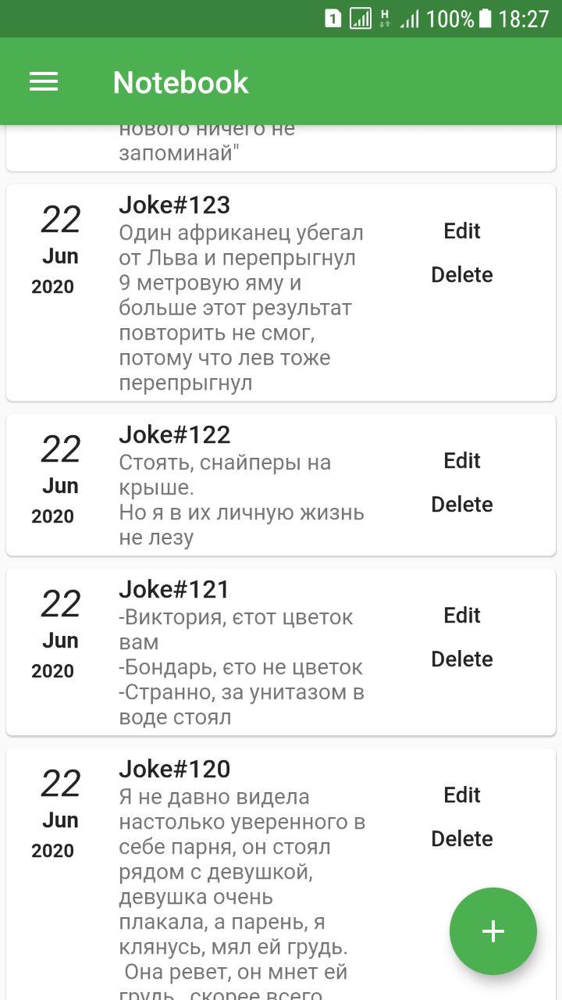
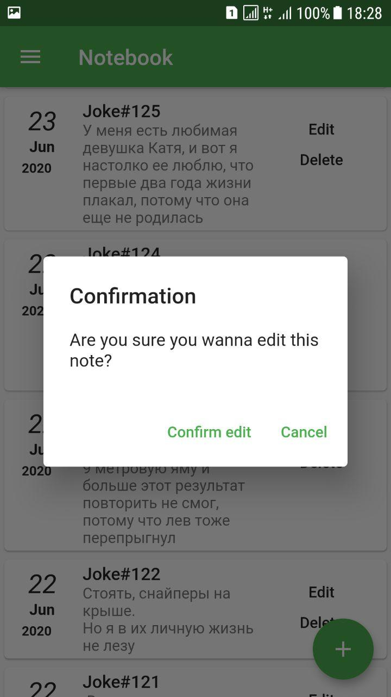
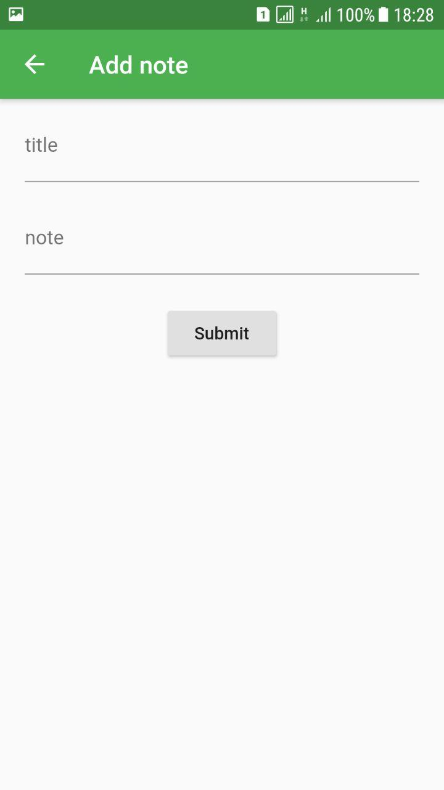
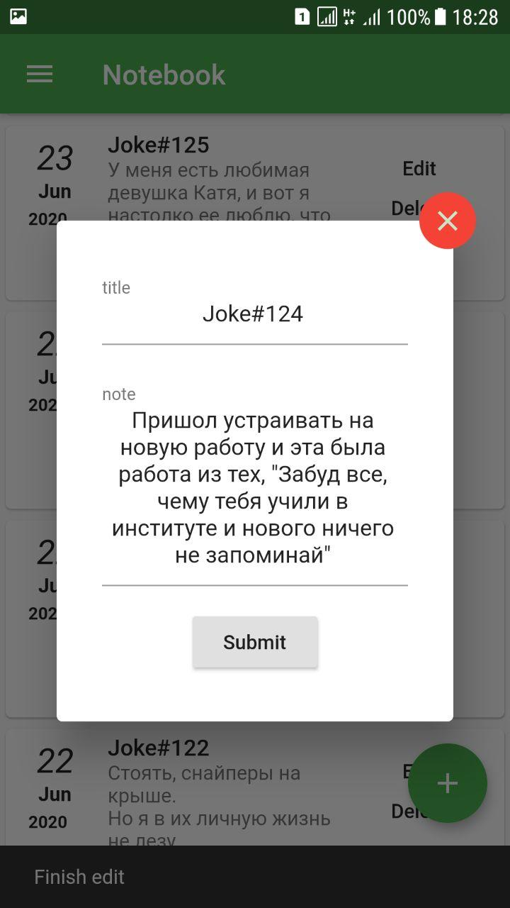

<h2>Overwiew</h2>
<h6>This is simple Android CRUD app. This app not for commercial use. This app just for me. Just diary for me. App is server less. App not require internet.For a while application tested only for Android 510F.
    
Flutter as client and Java as server side <h6>

<h2>Screenshots</h2>

<h2>Frameworks and tools</h2>

<h6>
    Java&IDE: JDK8 Androdi-Studio 
    Frontend: Flutter  
    Database: sqlite 
    Build Tool: Maven Gradle 
    Linux： Arch Linux 
    Other: Jakson, Gson, Android mail, Commons-io  
</h6>

<h2>System Features</h2>

<h6>
    <ul>
        <li>CRUD(create, read, update, delete)</li>
        <li>Ability export database to gmail</li>
        <li>Ability import database from server</li>
   </ul> 
</h6>
